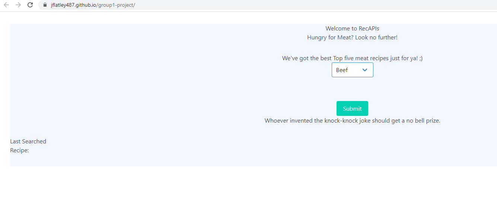
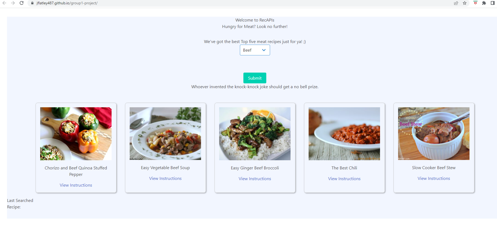
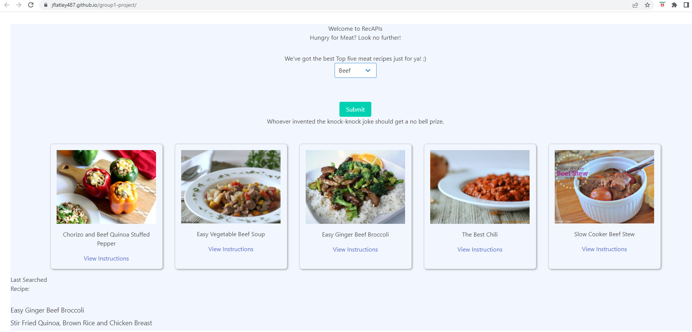

# recAPI

## Overview

A web *application* ( https://jflatley487.github.io/group1-project ) that allows a user to **search** for **recipes** that include certain proteins.  The user will select a protein from a drop-down box.  Upon clicking the ***submit*** button, the user will be presented with the top 5 **recipes ** from Spoonacular for the selected protein.  

When the user clicks on a **recipe** link, the **recipe** link will appear as a clickable link on the homepage.  The last 5 **recipes** visited

Additionally, on page load, the user will be presented with a new **joke**. 

The user will be able to **search** via a drop-down box for:  

- Beef  
- Pork  
- Chicken    
- Fish    
- Shellfish    

## Technologies Used

- Bulma CSS framework
- APIs  
    -https://api.spoonacular.com/recipes

    -https://icanhazdadjoke.com

## Usage  

In order for the *application* to be used, the user can go to https://jflatley487.github.io/group1-project and begin utilizing the **search** function immediately.  The user will be presented with a **joke** immediately on page load and for a new **joke**, the user simply needs to refresh the page.  The user does not need any additional extensions, plugins or downloads for this *application*. 

    

    

  

## Contributors  

Tim Mackie https://github.com/Timmackie

Joey Flatley https://github.com/Jflatley487

Lanre Abu https://github.com/lanreabu77

Stephanie Jauch https://github.com/Jflatley487
